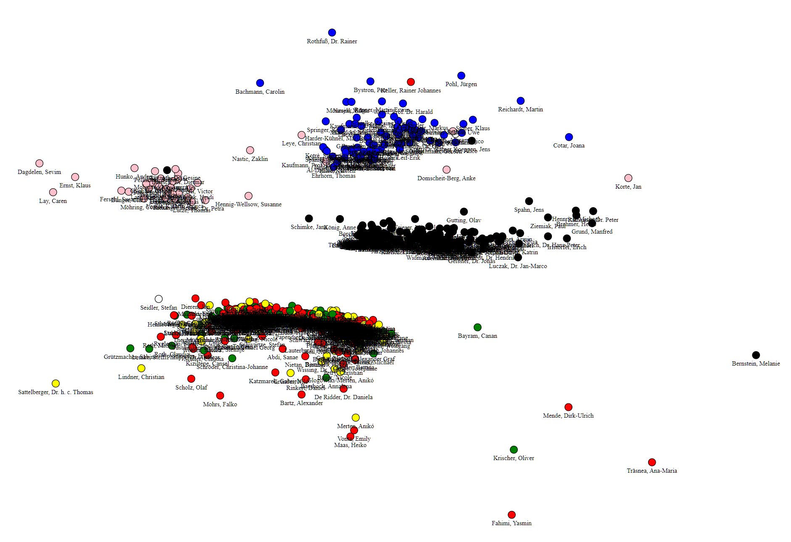

# German Member of Parliament Vote Behaviour

This project aims to gather information from the voting behaviour of the members of the german parliament. It collects the publicly available data from [www.bundestag.de/abstimmung](https://www.bundestag.de/abstimmung) including names, state and party of the members and the vote that they casted for every individual matter. For all matters name, description, date and additional links are collected.

With this data insights into the voting of members or parties can be gathered. An example use case is included in this repository showing the "attraction" of members in terms of matching votes for a specific matter. This attraction value is then visualized with a spring network simulation.

## How to run

To run the data acquisition and processing you need to install the following tools:

- Node.JS
- npm or yarn
- typescript
- python 3
- jupyter notebook

To run the data acquisition compile the typescript source files with `tsc`. Then, run the index.js file with `node ./dist/index.js`. An alternative is to use `ts-node src/index.ts` to compile and run the file directly. Please make sure to uncomment the desired steps in the index file. With that the files in the `data` directory are created, as well as the files `members.json` and `attraction.json`, if configured.

To run the attraction use case data processing run `jupyter notebook`. Then, execute the notebook found in `src/attraction/attraction.ipynb`. This generates the svg files in the `out` directory.

## License
This project is licensed under GPL 3.0.